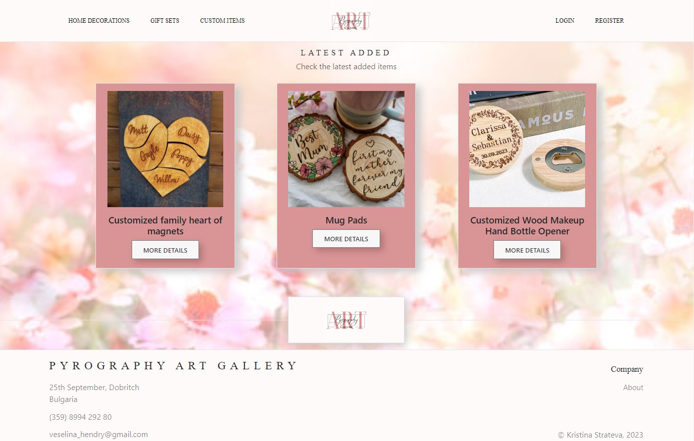

<h1>Pyrography ART Gallery</h1>

Welcome to Pyrography ART Gallery, an immersive platform that celebrates the art of pyrography. Our application is a curated gallery where pyrography enthusiasts can explore and appreciate the beauty of meticulously crafted items.
<h2>General Information</h2>

<ul>
<li>Pyrography ART Gallery creates a dedicated online space for pyrography enthusiasts to showcase their creations, fostering a vibrant and supportive community.</li>
</ul><ul>
<li>By organizing items into collections and providing a dynamic home page, PyroCraft Haven serves as a centralized platform where users can easily explore and discover a variety of pyrography pieces.</li>
</ul><ul>
<li>The purpose of Pyrography ART Gallery is to cultivate a thriving community, celebrate artistic talent, facilitate learning, encourage personal expression, overcome existing limitations, and provide a unique online experience for individuals passionate about the art of pyrography.</li>
</ul><h2>Technologies Used</h2>

<ul>
<li>HTML</li>
</ul><ul>
<li>CSS</li>
</ul><ul>
<li>JavaScript</li>
</ul><ul>
<li>React</li>
</ul><ul>
<li>Vite</li>
</ul><ul>
<li>React Router DOM</li>
</ul><ul>
<li>Bootstrap</li>
</ul><ul>
<li>React Bootstrap</li>
</ul><h2>Features</h2>

<ul>
<li><b>Collections:</b> Explore three distinct collections - Home Decorations, Gift Sets, and Custom Items. Each collection embodies the passion and creativity of pyrography, offering a unique visual journey.</li>
</ul><ul>
<li><b>User Creations:</b> For logged-in users, PyroCraft Haven opens the door to artistic expression. Create, edit, and delete your items, shaping them with the warmth of your creativity. Each item tells a story, and you have the power to craft your narrative.</li>
</ul><ul>
<li><b>Dynamic Home Page:</b> The home page dynamically showcases the last three added items, creating an ever-evolving visual experience. Witness the latest additions and be inspired by the diversity of pyrography.</li>
</ul><ul>
<li><b>Authentication Tracking:</b> A custom hook ensures seamless authentication for users, tracking login, register, and logout activities across various routes. Feel the connection with the community as you navigate through Pyrography ART Gallery.</li>
</ul><ul>
<li><b>Like Functionality:</b> Express your appreciation for fellow artists with the like functionality. Each like is a virtual nod of approval, creating a sense of camaraderie within the Pyrography ART Gallery community.</li>
</ul>
<h2>Screenshots</h2>

<h2>Acknowledgement</h2>

<ul>
<li>This project was inspired by my sister Veselina Hendry</li>
</ul><ul>
<li>Many thanks to Mr. Papazov</li>
</ul><h2>Contact</h2>

